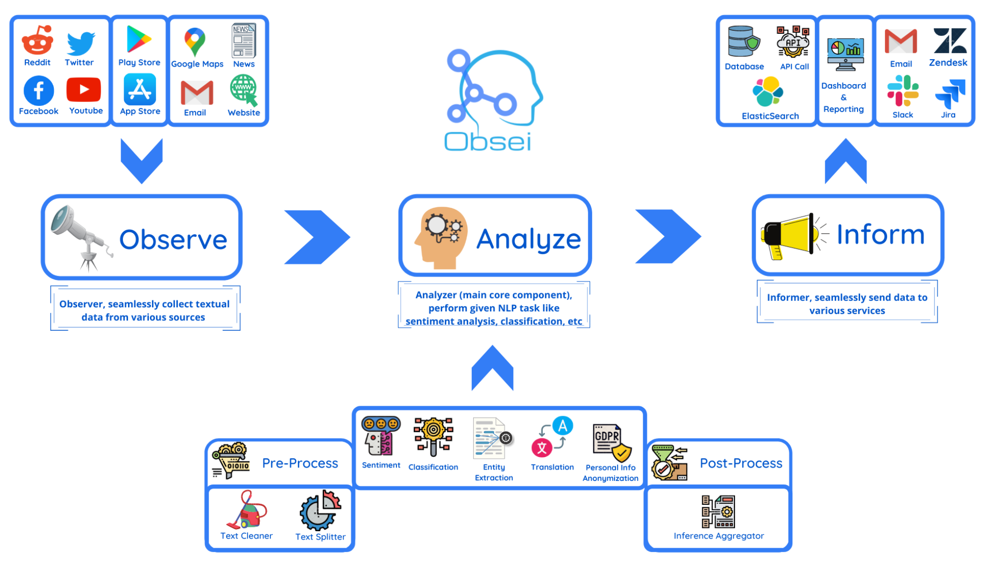

# Sentiment Analysis with Obsei

This project leverages the **Obsei framework** in conjunction with **Hugging Face Transformers** to perform sentiment analysis, entity extraction, and summarization on web articles. By combining advanced natural language processing (NLP) techniques with scalable workflows, this project delivers actionable insights tailored for various business and strategic purposes.

---

## **Objective**

The project aims to analyze web content and provide:
1. **Sentiment Analysis**:
   - Evaluate the tone of an article, classifying it as positive or negative with associated confidence levels.
2. **Key Phrase Extraction**:
   - Identify primary topics and themes for understanding content focus.
3. **Named Entity Recognition (NER)**:
   - Detect and classify names, organizations, and locations in the text.
4. **Summarization**:
   - Generate concise representations of articles to enhance readability and comprehension.

---

## **How Obsei Works**

### 1. **Overview**
Obsei (Observability for Sentiment and Insights) is an open-source, highly modular framework designed to:
- **Ingest data**: Extract information from sources like websites, social media platforms, customer reviews, and databases.
- **Analyze data**: Apply NLP pipelines, including sentiment analysis, summarization, classification, and NER.
- **Deliver insights**: Output processed results to dashboards, APIs, or other customizable sinks.  

  

### 2. **Key Features**
- **Pluggable Architecture**:
  - Mix and match sources, analyzers, and sinks without additional dependencies.
- **Multilingual Support**:
  - Analyze content in multiple languages, making it suitable for global use cases.
- **Pre-trained Models**:
  - Leverages pre-trained transformers, reducing the need for domain-specific training.

---

### **Technical Components**

#### 1. **Sources**
Data collection is the starting point for any analysis. Obsei provides flexible sources like:
- **TrafilaturaCrawlerSource**: For scraping and cleaning web content.
- **Social Media APIs**: (e.g., Twitter and Facebook).
- **File-based Sources**: Text files or logs.

#### 2. **Analyzers**
Analyzers are at the core of Obsei's processing pipeline, enabling various NLP tasks:
- **Sentiment Analysis**: Uses Hugging Face's DistilBERT for polarity classification.
- **NER (Named Entity Recognition)**: Extracts structured information like people, organizations, and places.
- **Text Summarization**: Utilizes Facebook’s BART or mBART for summarization.

#### 3. **Sinks**
Once insights are generated, they can be sent to:
- **Dashboards**: Real-time visualizations via BI tools.
- **Databases**: Store results in systems like MySQL, MongoDB, or Elasticsearch.
- **Notifications**: Push insights to messaging platforms like Slack or email.

---

### **Background Technologies**

#### 1. **Hugging Face Transformers**
- **BERT (Bidirectional Encoder Representations from Transformers)**:
  - A foundational transformer architecture for NLP.
- **DistilBERT**:
  - Optimized for speed and memory, perfect for sentiment tasks.
- **BART and mBART**:
  - Designed for text-to-text generation tasks like summarization and translation.

#### 2. **Trafilatura**
- A Python library specialized in web scraping, handling dynamic content extraction while discarding irrelevant data like ads or scripts.

#### 3. **Pipelines and Workflow**
- Obsei’s pipeline abstracts data flow from source to sink, reducing development overhead for NLP projects.

---

## **Advanced Use Cases for Businesses**

### 1. **Customer Sentiment Analysis**
- Analyze customer reviews or comments in real time to:
  - Detect dissatisfaction or satisfaction trends.
  - Identify areas for service improvement.

### 2. **Competitor Monitoring**
- Scrape competitor news and assess public sentiment about their products or strategies.

### 3. **Brand Reputation Management**
- Evaluate the perception of a brand across social media and news platforms.
- Extract entities to identify frequent mentions or stakeholders influencing opinions.

### 4. **Content Personalization**
- Summarize articles or reviews to deliver personalized content recommendations.
- Extract key phrases to tag and categorize articles effectively.

### 5. **Crisis Management**
- Monitor public sentiment during crises to:
  - Gauge customer reaction.
  - Identify early signs of potential PR issues.

---

## **Production-Ready Deployment**

### **Best Practices**
1. **Fine-tune Models**:
   - Tailor pre-trained models to specific domains for improved accuracy.
2. **Scalability**:
   - Use containers (e.g., Docker) or orchestration tools (e.g., Kubernetes) for deploying at scale.
3. **Real-Time Pipelines**:
   - Integrate with streaming frameworks like Apache Kafka for real-time insights.
4. **Data Privacy**:
   - Ensure compliance with data protection laws like GDPR when processing sensitive data.

---

## **Extended Functionality**

### 1. **Multi-language Support**
- Implement dynamic language detection using `langdetect` or similar libraries.
- Utilize models like mBERT or mBART for analyzing and summarizing non-English texts.

### 2. **Custom Model Training**
- Fine-tune sentiment or summarization models on custom datasets using Hugging Face's `Trainer` API.

### 3. **Integrations**
- Add support for:
  - **CRM tools** (e.g., Salesforce) for customer insights.
  - **Cloud Storage** (e.g., AWS S3) for storing processed results.
  - **Visualization Tools** (e.g., Tableau, Power BI).

### 4. **Prediction and Trend Analysis**
- Extend the pipeline to include predictive models for forecasting sentiment trends.
- Combine with time-series analysis for deeper insights into market or brand perception.

---

## **How to Use**

### 1. **Clone the Repository**
```bash
git clone https://github.com/your-repo/sentiment-analysis-obsei.git
cd sentiment-analysis-obsei
```

### 2. **Install Dependencies**
```bash
pip install transformers obsei trafilatura langdetect
```
Installing **all** requirements:  
```bash
pip install requirements.txt
```


### 3. **Run the Script**
```bash
python sentiment_analysis.py
```

### 4. **Examine the Results**
- The processed results are saved in `output_example.txt`.
- Insights include:
  - Sentiment classification with confidence scores.
  - Key phrases and named entities extracted.
  - A concise summary of the input text.
  - Sentences containing persuasive language.

---

## **Example Workflow**
1. Extract text from a news article using `TrafilaturaCrawlerSource`.
2. Detect language dynamically and set up multilingual NLP pipelines.
3. Perform sentiment analysis, NER, and summarization.
4. Save or forward processed insights to sinks for reporting.

---

## **Future Enhancements**

### 1. **Enhanced Accuracy**
- Train on domain-specific datasets (e.g., healthcare, e-commerce).

### 2. **Integration with Monitoring Systems**
- Incorporate Obsei pipelines into DevOps tools for real-time alerting based on sentiment analysis.

### 3. **Custom NLP Tasks**
- Develop pipelines for other NLP tasks like:
  - **Text classification** (e.g., spam detection).
  - **Aspect-based sentiment analysis** (e.g., isolating sentiment for specific topics).

### 4. **Knowledge Graphs**
- Combine NER outputs to create knowledge graphs, enabling deeper analysis of relationships between entities.

---

## **Conclusion**

Obsei bridges the gap between data collection and actionable insights. By integrating advanced NLP techniques with a flexible pipeline architecture, businesses can efficiently analyze web content and derive valuable sentiment-based insights. This project demonstrates how Obsei, Hugging Face Transformers, and Trafilatura can empower organizations to make informed decisions, enhance customer experiences, and stay ahead of the competition.

--- 

## **Acknowledgment**

This project was developed as an internship product for **iNet Solution**, showcasing the application of advanced NLP techniques to extract meaningful insights from web content. It demonstrates the potential of **Obsei** and Hugging Face Transformers for sentiment analysis, summarization, and trend detection.

--- 
