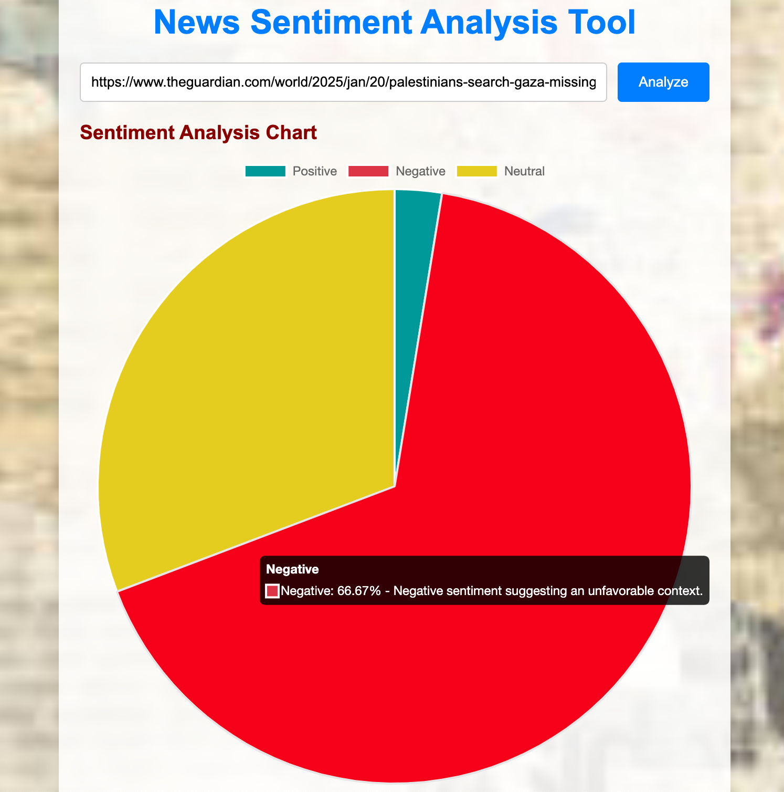
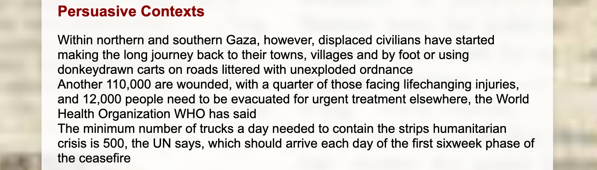

# **Sentiment Analysis with Obsei**

This project leverages the **Obsei framework** alongside **Hugging Face Transformers** to analyze text data by performing sentiment analysis (by model **twitter-xlm-roberta-base-sentiment** and **distilbert-base-multilingual-cased**), named entity recognition (NER model **bert-base-NER**), fact-checking (Google Fact Check API), and summarization (facebook model **bart-large-cnn**). It combines cutting-edge Natural Language Processing (NLP) techniques with customizable pipelines, delivering actionable insights for various business and strategic needs.

---

## **Table of Contents**

1. [Introduction to Obsei](#introduction-to-obsei)
2. [Core Features](#core-features)
3. [Technical Foundations](#technical-foundations)
4. [Business Applications](#business-applications)
5. [How Obsei Works](#how-obsei-works)
6. [Extending Obsei](#extending-obsei)
7. [Getting Started](#getting-started)
8. [Production Deployment](#production-deployment)
9. [Future Enhancements](#future-enhancements)
10. [Project Setup](#project-setup)
11. [Deploying Locally](#deploying-locally)
12. [Conclusion](#conclusion)
13. [Acknowledgment](#acknowledgment)

---

## **Introduction to Obsei**

### **What is [Obsei](https://www.obsei.com/)?**

**Obsei** (Observability for Sentiment and Insights Extraction) is an open-source, modular framework designed to simplify data extraction, processing, and analysis. It allows developers to create highly customizable NLP pipelines for sentiment analysis, summarization, keyword detection, and more 📊.

Its **pluggable architecture** integrates seamlessly with various data sources (e.g., websites, social media, or APIs) and outputs processed insights to desired destinations like dashboards, databases, or messaging systems.

### **Why Use Obsei?**
- **Efficient Automation**: Streamlines repetitive data collection and analysis tasks.
- **Scalability**: Processes vast datasets with minimal configuration.
- **Cost-Effective**: Open-source with no licensing costs.
- **Flexibility**: Supports multi-language analysis and domain-specific customizations.

  

---

## **Core Features**

### 1. **Data Extraction**
- Fetches structured and unstructured data from:
  - Websites using web crawlers (e.g., Trafilatura).
  - Social media platforms like Twitter and Reddit.
  - File-based sources or APIs.

### 2. **Sentiment Analysis**
- **Binary or Multi-Class Sentiment Classification**:
  - Positive, Negative, or Neutral sentiment detection.
  - Multilingual support using models like `distilbert-base-multilingual-cased`.

### 3. **Named Entity Recognition (NER)**
- Identifies and classifies:
  - **People** (e.g., CEOs, politicians).
  - **Organizations** (e.g., companies, NGOs).
  - **Locations** (e.g., cities, countries).
  - Merges fragmented entities for clean outputs.

### 4. **Summarization**
- Generates concise summaries from large text inputs using models like `BART`.
- Dynamically adjusts summary lengths based on input complexity.

### 5. **Keyword and Topic Extraction**
- Detects recurring themes, topics, or phrases from text.

### 6. **Customizable Pipelines**
- Mix and match sources, analyzers, and sinks to build workflows for specific use cases.

---

## **Technical Foundations**

### **Architecture**
Obsei operates through three core components:
1. **Sources**:
   - Fetch raw data (e.g., TrafilaturaCrawlerSource for web scraping).
2. **Analyzers**:
   - Perform NLP tasks like sentiment analysis, summarization, and NER.
3. **Sinks**:
   - Output processed insights to destinations (e.g., dashboards, databases).

### **NLP Models and Mathematics**
- **Transformer Models**:
  - BERT-based models (e.g., DistilBERT, BART) leverage self-attention mechanisms for language understanding.
- **NER**:
  - Token classification using fine-tuned models like `bert-large-cased`.
- **Summarization**:
  - Sequence-to-sequence frameworks (e.g., `BART`) encode and decode text into summaries.

### **Technologies**
+ **Hugging Face Transformers**: Provides state-of-the-art NLP models. Transformer models work by processing input data, which can be sequences of tokens or other structured data, through a series of layers that contain self-attention mechanisms and feed-forward neural networks.  
    

+ **Trafilatura**: Handles web scraping and content cleaning. Trafilatura scrapes the main text of web pages while preserving some structure, a task which is also known as boilerplate removal, DOM-based content extraction, main content identification, or HTML text cleaning. The result of processing can be in TXT, CSV, JSON & XML formats. Find more on [Trafilatura Document](https://trafilatura.readthedocs.io/en/latest/quickstart.html). Other similar web-scrapping tool (that can even perform better), outside of Obsei environment that can also being used include [Selenium](https://www.selenium.dev/) and [BeautifulSoup](https://tedboy.github.io/bs4_doc/).

+ **Google Fact Check**: Fact checking assigned statements on real-time data for enhanced information credibility. This tool using creates, adds, and deletes ClaimReview markup for a site's fact-checking articles, URLs or simply a short statement. Find more on [Google Fact Check Document](https://newsinitiative.withgoogle.com/resources/trainings/google-fact-check-tools/)

+ **Python Pipelines**: Orchestrates data flow seamlessly.

---

## **Business Applications**

### 1. **Customer Feedback Analysis**
- Detect trends in reviews, survey responses, or social media mentions.
- Extract actionable insights like common complaints or satisfaction drivers.

### 2. **Competitor Monitoring**
- Analyze sentiment and keywords in competitor news or advertisements.
- Uncover market opportunities and risks.

### 3. **Marketing Campaign Evaluation**
- Assess public sentiment during and after campaigns.
- Detect negative messaging by competitors.

### 4. **Crisis Management**
- Monitor real-time sentiment to guide public relations strategies.
- Detect early signs of potential PR crises.

### 5. **Product Development**
- Analyze feedback to prioritize product features.
- Identify pain points using sentiment-weighted analysis.

---

## **How Obsei Works**

### **Step-by-Step Workflow**

1. **Data Collection**:
   - Extracts data from specified sources (e.g., web articles, tweets) using web scrapper.
2. **Language Detection**:
   - Determines the language of the input text dynamically. Thus assigning and integrating across different destined LLM model.
3. **Data Analysis**:
   - Processes text using transformers for sentiment classification, NER, and summarization.
4. **Output Routing**:
   - Saves or forwards insights to desired destinations (e.g., Slack, Elasticsearch).

---

## **Extending Obsei**

### **Customization**
- Replace pre-trained models with domain-specific ones.
- Add new sources (e.g., LinkedIn data scraping) or sinks (e.g., Power BI integration).

### **Advanced Use Cases**
- **Predictive Analytics**:
  - Forecast trends based on historical sentiment data.
- **Behavioral Analysis**:
  - Analyze customer support interactions for intent prediction.

---

### **Fact Checking**
- We use Google Fact Check tool to validate negative statement pointing to any individual or organization, country.
- Using Google Fact Check API to send query on real time looking up for data credibility on an instant.

---

## **Getting Started**

### **1. Clone the Repository**
```bash
git clone https://github.com/Lelekhoa1812/Sentiment-Analysis-with-Obsei.git
cd Sentiment-Analysis-with-Obsei
```
Installing scraper and source observer libraries from obsei via:
```bash
pip install --editable .\[all\]
```
Or downloading each tools individually via [Obsei associated dependencies](https://github.com/Lelekhoa1812/Sentiment-Analysis-with-Obsei/blob/main/dependencies.md).

### **2. Install Dependencies**
Install requirements for this project:  
```bash
pip install -r requirements.txt
```

### **3. Run the Script**
```bash
python sentiment_analysis.py
```

### **4. View the Results**
- Processed insights will be saved in `output_example.txt`. Example [output](https://github.com/Lelekhoa1812/Sentiment-Analysis-with-Obsei/blob/main/obsei_analysis.txt).

### **5. Fetch saved results from database**
- Each analysis result can be saved to MongoDB, with user need to create a `.env`
environment file to store data on db. Running this script to fetch result data from the database, write and saved in `txt` format:
```bash
python3 fetchdb.py
```   
Example [retrieval of result data](https://github.com/Lelekhoa1812/Sentiment-Analysis-with-Obsei/blob/main/database_data.txt) saved from MongoDB(formatted as JSON).  

---

## **Production Deployment**

### **Best Practices**
1. **Fine-Tune Models**:
   - Use domain-specific datasets to improve model performance.
2. **Containerization**:
   - Use Docker or Kubernetes for scalable deployment.
3. **Data Security**:
   - Ensure compliance with GDPR or CCPA for sensitive data handling.

---

## **Future Enhancements**

### 1. **Real-Time Dashboards**
- Integrate with tools like Tableau or Streamlit for interactive visualizations.

### 2. **Knowledge Graphs**
- Link extracted entities to create relational graphs.

### 3. **Ethics and Bias Detection**
- Implement fairness metrics to identify biases in predictions.

---

## **Project Setup**
```plaintext
INET/
├── obsei/                 # Cloned obsei repo
├── static/                # All static contents like CSS, JS
│   ├── styles.css
│   ├── script.js
├── templates/             # All HTML UI templates
│   └── index.html
├── server.py              # Flask server
├── sentiment_analysis.py  # To use python on terminal
├── fetchdb.py             # Fetch and save data from MongoDB
├── obsei_analysis.txt
├── database_data.txt
├── README.md
├── dependencies.md
├── requirements.txt
```

---

## **Deploying Locally**
UI Demo can be deployed locally on your device with Flask app. Following these instructions:  

- Installing latest Flask version if you haven't:  
```bash
pip install flask
```

- Installing all necessary modules:  
```bash
pip install requirements.txt
```

- Start the Flask server:  
```bash
python server.py
```

- The server will run on your 5002 port http://127.0.0.1:5002.

- Web Demo:  

 

 

 

 

 

 
---

## **Conclusion**

Obsei is a powerful framework for automating text data analysis, enabling businesses to derive actionable insights efficiently. Its modular design and integration capabilities make it a valuable tool for sentiment analysis, NER, and summarization across industries. As the framework evolves, it holds immense potential for predictive analytics, cross-lingual insights, and anomaly detection, empowering businesses to stay ahead in a data-driven world.

---

## **Acknowledgment**

This project was developed as part of an internship product for **iNet Solution**, showcasing the integration of advanced NLP techniques with scalable workflows to provide meaningful insights from web content.

---

Latest update on 07/02/2025. Author: Dang Khoa Le.